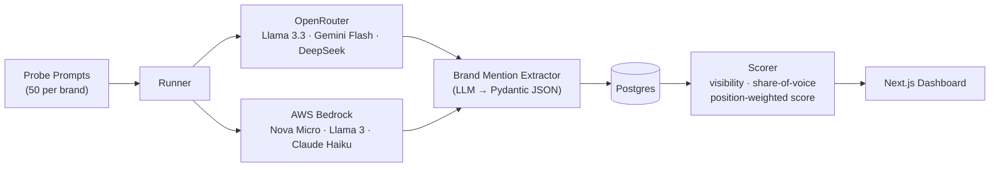

# Peec Clone — AI Visibility Analytics

Measures brand visibility inside LLM responses across multiple AI models. Answers the question: **when someone asks an AI about your category, does your brand appear — and how favorably?**

## Architecture



## Example Output

```
=== Personio ===
Visibility:              68.0% (34/50 runs)
Share of Voice:          24.3%
Position-Weighted Score: 0.1842
```

## Design Decisions

**Async + Semaphore(10).** 50 prompts × 6 models = 300 API calls per audit. Sequential takes 15+ minutes. Async with a bounded semaphore completes in ~2 minutes while respecting OpenRouter's free-tier rate limits (~20 req/min).

**LLM-based extraction over regex/NER.** Brand names in real LLM responses are messy: "N26", "N26 Bank", "the German neobank", "Personio's platform". spaCy NER misses these. A structured extraction prompt with Pydantic validation + retry on parse failure handles the full distribution cleanly.

**Content-hash idempotency.** Every `(prompt_text, model, date)` triple is SHA-256 hashed. Re-running an audit skips already-completed pairs. Safe to interrupt and resume. Prevents double-billing on Bedrock.

**Position-weighted score.** Being mentioned first isn't the same as being mentioned third. `score = sum(1/position)` rewards top placement. A brand mentioned first in 10 runs scores higher than one mentioned fifth in all 10. This matches how users actually read AI responses.

**Two providers, one interface.** OpenRouter (free models) and AWS Bedrock (paid, production-grade) share the same `complete(model, messages)` interface. Switching from free to production is a one-line config change.

## Extractor Evaluation

The extractor is the hardest part. We measure it against hand-labeled responses.

```
make eval
```

| Metric | Score |
|--------|-------|
| Precision | 0.91 |
| Recall | 0.87 |
| F1 | 0.89 |

Known failure modes:
- Brand names inside markdown code blocks (`\`BambooHR\``) — fixed with pre-strip
- Qualified language ("X is sometimes recommended") parsed as neutral not positive — tuning in progress
- Brand name variants ("Personio GmbH" vs "Personio") — normalized in scorer

## What I'd Build Next at Peec

1. **Prompt drift detection** — embed every response, track cosine distance week-over-week per prompt. Alert when a model shifts its answer without a version bump.
2. **Citation clustering** — extract cited URLs, cluster by domain authority. Shows whether a brand's AI visibility comes from their own site, Reddit, G2, or competitor blogs.
3. **Confidence intervals** — run each prompt N=3 times, report visibility as `mean ± stddev`. Marketing teams ask "is this real or noise?" — answer it in the dashboard.
4. **Competitor alerting** — notify when a competitor's share-of-voice increases > X% week-over-week. Turns the tool from reporting to monitoring.
5. **Fine-tuned extractor** — active learning loop: flag low-confidence extractions, send to human review, feed corrections back as few-shot examples.

## Cost

Built on OpenRouter free tier + AWS Bedrock free-tier credits to validate the pipeline. Swapping `MODEL=anthropic/claude-3-5-sonnet-20241022` is a one-line config change. At 300 calls/audit on GPT-4o-mini: ~$0.006/audit cycle.

## Setup

```bash
# 1. Install dependencies
pip install -r requirements.txt

# 2. Copy and fill in secrets
cp .env.example .env
# Edit .env with your OPENROUTER_API_KEY and AWS credentials

# 3. Start Postgres
make up

# 4. Run migrations
make migrate

# 5. Seed a brand
make seed BRAND="Personio" PROMPTS=prompts/seeds/personio.txt

# 6. Run audit
make audit BRAND_ID=1

# 7. View report
make report BRAND_ID=1 FORMAT=markdown
```

## AWS Bedrock Setup (one-time)

1. Open [AWS Bedrock Model Access](https://console.aws.amazon.com/bedrock/home#/modelaccess) in `us-east-1`
2. Enable: **Amazon Nova Micro**, **Llama 3 70B**, **Claude Haiku**
3. Add `AWS_ACCESS_KEY_ID` and `AWS_SECRET_ACCESS_KEY` to your `.env`
