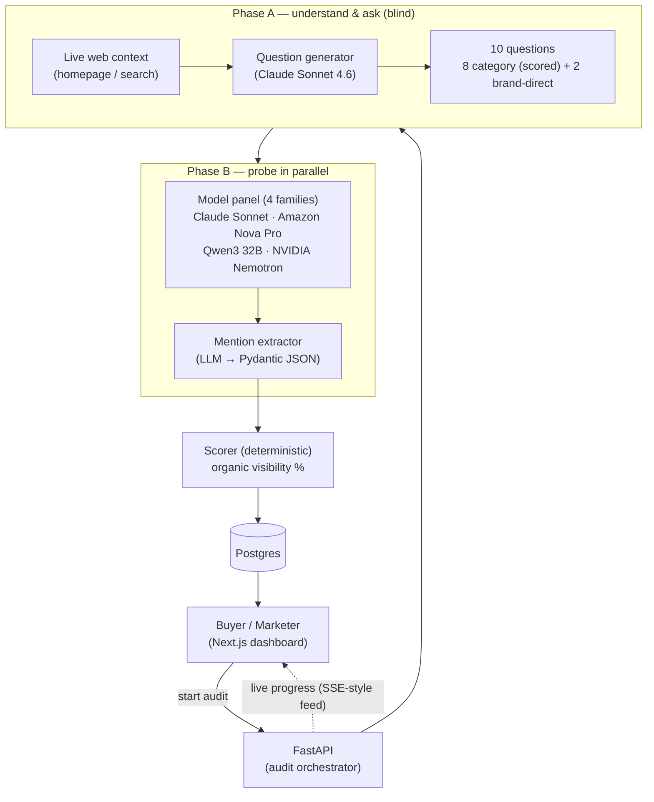

# Aura AI — Brand Visibility for the AI Search Era

When buyers research what to buy, they increasingly ask an AI assistant instead of a search engine. *"What's the best applicant tracking system for a 200-person company?"* The models name a handful of brands. **If yours isn't one of them, you're invisible at the exact moment of decision — and unlike SEO, there's no results page to check.**

Aura AI measures that. It runs the questions a real buyer would ask across several leading AI models, detects whether a brand surfaces organically, and reports a visibility score with a per-model and per-question breakdown.

---

## What it measures

**Organic visibility** — the percentage of category buyer questions where a brand is mentioned *without being named in the question*. This is the number that matters: it reflects whether a model recommends you on its own, not whether it can echo a name you handed it.

A worked example from the live demo (recruiting software):

| Brand | Visibility | Read |
|---|---|---|
| Greenhouse | 81% | Strong incumbent — surfaces on most generic ATS questions |
| Lever | 75% | Well-established, broadly recommended |
| Workday | 69% | Recognized, more enterprise-skewed |
| Ashby | 0% | Newer/niche — not yet recommended for generic ATS queries |

That 0%→81% spread is the point: the score discriminates. A tool that scored every brand ~90% would be measuring nothing.

---

## The core design problem: avoiding measurement bias

The hard part of this product is not calling models — it's asking *fair* questions.

If the question generator knows which brand it's evaluating, it will (even unintentionally) shape "category" questions around that brand's strengths — and the brand then appears ~100% of the time. The score looks great and means nothing.

Aura solves this by generating questions in **two blind pools**:

1. **Category questions (scored)** — generated from the *industry only*. The generator is never told the brand name, so the questions stay neutral to the category (*"which CRM is easiest for a small sales team to set up?"*). These are the only questions that count toward the visibility score.
2. **Brand-direct questions (unscored)** — generated *with* the brand, for the detail view (pricing, integrations, head-to-heads). Excluded from scoring, because a model trivially repeats a name it was given.

This separation is what makes the score honest.

---

## Architecture



**Two-phase audit.** Phase A grounds the brand in live web context and writes the questions. Phase B fires every question across the model panel **concurrently** (one bounded wave, not sequentially), extracts brand mentions from each answer with a structured LLM extractor, and a fast model (Claude Haiku) writes the factual summary.

**Four model families on purpose.** Claude Sonnet 4.6, Amazon Nova Pro, Qwen3 32B, and NVIDIA Nemotron — four *different* vendors so "cross-model visibility" is a credible measurement rather than one lab's opinion. Failed model calls are excluded from the denominator (a model that errored is "unknown," never counted as a "no").

---

## Deterministic vs. AI — a deliberate split

LLMs are used **only** where natural-language understanding is genuinely required; everything checkable is plain code.

| Done in code (deterministic, unit-tested) | Done by an LLM (needs NLU) |
|---|---|
| Visibility %, per-model breakdown, aggregation | Generating buyer questions |
| Brand-name matching (word-boundary regex, so "Lever" ≠ "Cleverbit") | Extracting brand mentions from prose |
| Rate limiting, audit-concurrency control, cost calc | Verifying entity identity (right company?) |
| JSON parsing + truncation salvage | Writing the analysis summary |

---

## Tech stack

- **Backend:** FastAPI (async), SQLAlchemy, Postgres
- **AI:** AWS Bedrock (Converse API, cross-region inference), four model families
- **Frontend:** Next.js (App Router), TypeScript, Tailwind, Recharts
- **Infra:** Docker Compose (`db` · `app` · `web` · `caddy`); Caddy is the only public entry and terminates TLS automatically
- **Tests:** 147 backend (pytest) + 40 frontend (Jest) = 187

---

## Multi-user model

- Each visitor gets a persistent client-side **session id**; their brands and audits are isolated to that session.
- **Admin mode** (`?admin=<KEY>`, verified server-side via the `X-Admin-Key` header) sees all brands and runs without the per-session limit.
- A non-admin session is capped at **2 audits**; in-flight and queued audits both count toward the cap, so a third request is rejected even before the first two finish.
- **Delete is asymmetric by design:** a user delete hides the brand from that user; an admin delete removes it everywhere. Audits already in flight for a brand block a duplicate run.

---

## Running it locally

Everything runs in Docker — no local Python/Node setup needed.

```bash
# 1. Configure secrets
cp .env.example .env
#    Set AWS credentials (or attach an IAM role in prod — see DEPLOY.md),
#    a strong POSTGRES_PASSWORD, and an ADMIN_KEY. Never commit .env.

# 2. Build and start the full stack (db, app, web, caddy)
docker compose up -d --build

# 3. Open the app
#    http://localhost   (Caddy proxies the frontend and /api to the backend)
```

The app applies its schema migrations on startup and seeds a small set of example brands automatically. `POSTGRES_USER`/`POSTGRES_DB` default to `peec` — an internal database identifier only; the product is **Aura AI**.

> **Bedrock note:** the model IDs use the `eu.` cross-region-inference prefix, so the AWS region must be `eu-central-1` (Frankfurt) and those models must be enabled in the Bedrock console, or every probe will fail. The exact IDs live in `src/llm/bedrock_client.py`.

A `Makefile` also exposes a CLI/eval path (`make audit`, `make eval`) used for offline experimentation; the web app above is the primary interface.

---

## Production deployment

See **[DEPLOY.md](DEPLOY.md)** for the full runbook: secret rotation (IAM role instead of static keys), the EC2 `.env`, security-group rules, HTTPS via Caddy, and the smoke test. Deployment is a single `./deploy.sh` on the box once secrets are in place.

---

## Repository layout

```
src/
  agents/orchestrator.py   two-phase audit engine (question gen, probes, scoring)
  api/                     FastAPI app, routes, auth, rate limiting
  llm/                     Bedrock client, structured mention extractor
  pipeline/                deterministic scorer + offline runner
  models.py                SQLAlchemy schema
web/                       Next.js dashboard (brand detail, compare, share)
caddy/                     reverse proxy + auto-TLS
tests/                     pytest (unit + integration)
```
