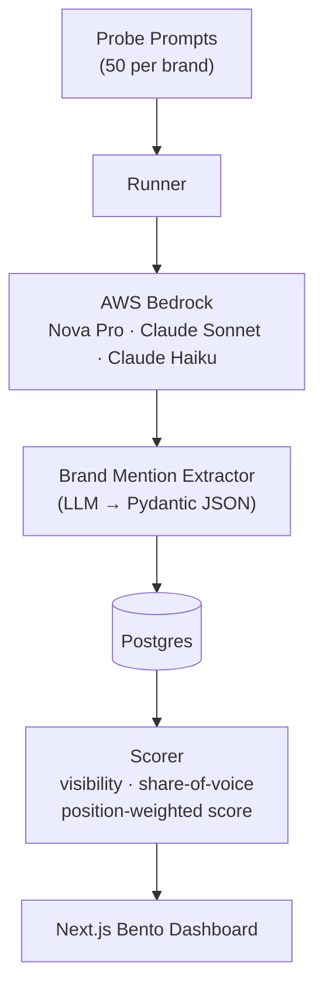

# Aura AI — Visibility Engine

Measures brand visibility inside LLM responses across multiple AI models. Answers the question: **when someone asks an AI about your category, does your brand appear — and how favorably?**

---

## Architecture



---

## Features & Product Strategy

### 👥 Dual-Board View (Admin vs Guest Sessions)
To prevent rate-limit exhaustion and API key over-expenditure, the engine separates traffic into two interfaces via a toggle in the header:
- **Guest Board (User)**: When a new user lands on the dashboard, they are assigned a persistent client-side session ID. This gives them a clean, isolated dashboard workspace where they can track their own brand and view only their specific analytics.
- **Admin Board**: A dedicated board (accessible via the role selector) that allows system admins to see all tracked brands globally, run parallel audits, and manage the database.

### 🍱 Premium Glassmorphic Bento Grid
The dashboard utilizes an **Obsidian Glow** theme built using a custom HSL layout system:
- High-level KPIs (average visibility, best performing, total tracked) are presented in glass cards with color-coded ambient glows.
- Dynamic 12-column Bento grids group comparative charts, brand tables, and tracking controllers.
- Accessible keyboard focus overlays, minimum 44px touch targets, and vector SVG iconography.

### 🗑️ direct Unaudited Brand Deletion
Users and admins can clean up their workspaces by deleting both audited and pending (unaudited) brands directly from the sidebar. Deleting a brand cascade-deletes all associated prompts, runs, mentions, insights, and performance charts in correct foreign-key sequence.

### ☁️ AWS Bedrock Production Reliability
The system relies on AWS Bedrock models for enterprise-grade response auditing, supporting Amazon Nova Pro, Meta Llama 3, and Anthropic Claude systems. Latencies are tracked per model inside `api_calls` for pipeline performance profiling.

---

## Example Output

```
=== Personio ===
Visibility:              68.0% (34/50 runs)
Share of Voice:          24.3%
Position-Weighted Score: 0.1842
```

---

## Design Decisions

**Async + Semaphore(10).** 50 prompts × 4 models = 200 API calls per audit. Sequential takes 10+ minutes. Async with a bounded semaphore completes in under 2 minutes while respecting API rate limits.

**LLM-based extraction over regex/NER.** Brand names in real LLM responses are messy: "N26", "N26 Bank", "the German neobank", "Personio's platform". spaCy NER misses these. A structured extraction prompt with Pydantic validation + retry on parse failure handles the full distribution cleanly.

**Content-hash idempotency.** Every `(prompt_text, model, date)` triple is SHA-256 hashed. Re-running an audit skips already-completed pairs. Safe to interrupt and resume. Prevents double-billing on Bedrock.

**Position-weighted score.** Being mentioned first isn't the same as being mentioned third. `score = sum(1/position)` rewards top placement. A brand mentioned first in 10 runs scores higher than one mentioned fifth in all 10. This matches how users actually read AI responses.

---

## Setup

```bash
# 1. Install dependencies
pip install -r requirements.txt

# 2. Copy and fill in secrets
cp .env.example .env
# Edit .env with your AWS Bedrock credentials (DO NOT share or commit this file)

# 3. Start Postgres database
make up

# 4. Run migrations
make migrate

# 5. Seed a brand
make seed BRAND="Personio" PROMPTS=prompts/seeds/personio.txt

# 6. Run audit
make audit BRAND_ID=1

# 7. View report
make report BRAND_ID=1 FORMAT=markdown
```

---

## AWS Bedrock Setup (one-time)

1. Open [AWS Bedrock Model Access](https://console.aws.amazon.com/bedrock/home#/modelaccess) in `us-east-1`
2. Enable: **Amazon Nova Pro**, **Llama 3 70B**, **Claude Haiku**, **Claude Sonnet**
3. Add `AWS_ACCESS_KEY_ID` and `AWS_SECRET_ACCESS_KEY` to your `.env`
